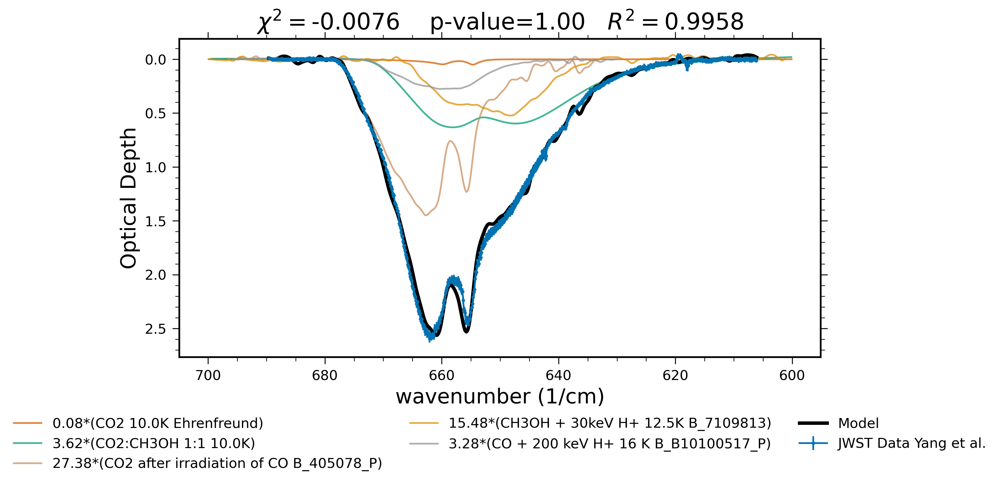
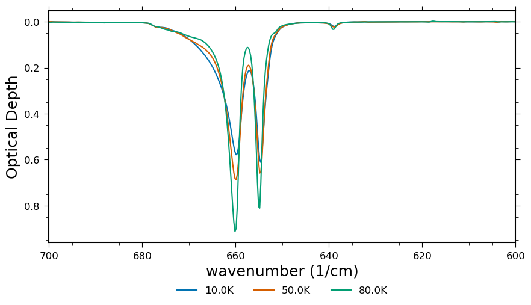
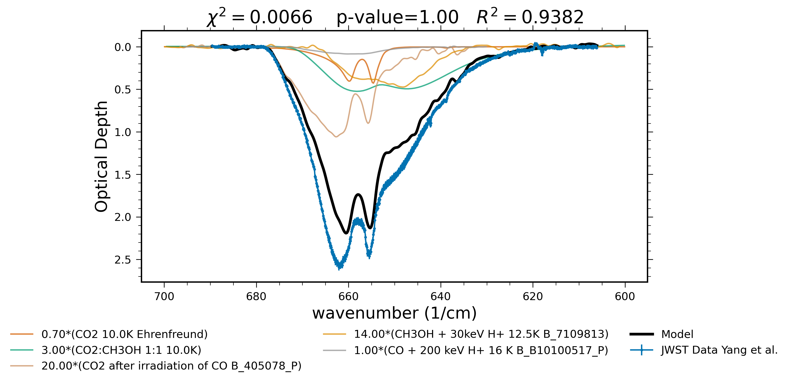

```python
import pandas as pd
import numpy as np
import matplotlib.pyplot as plt
#import json
import mist
from scipy.optimize import curve_fit
```

# Overview of MIST
https://github.com/Lars314/mist


MIST (Molecular Ice Spectrum Tool) is a tool made to fit the bending mode of CO2 observed in Class 0 Protostar IRAS 15398-3359 using data from [Yang et al. (2022)](https://ui.adsabs.harvard.edu/abs/2022ApJ...941L..13Y/abstract). It has since been generalized so that it can be used for other projects as well.

To use MIST you need to have a json file that outlines the observed spectrum and the spectra you want to fit with. How you should configure that json file is written below. Then you should be able to just set the wavenumber range you want to fit to, and go!

# Quick Example

In the quick example, we want to fit the CO2 bending mode as observed in Class 0 protostar IRAS 15398-3359 using data from [Yang et al. (2022)](https://ui.adsabs.harvard.edu/abs/2022ApJ...941L..13Y/abstract).


```python
import mist

# Define the spectral region you want to fit to, in wavenumbers (cm^-1)

# the lower limit
wn_min = 600
# the upper limit:
wn_max = 700

# Create the fit model based on your configuration file
model = mist.Fitter("./spectra_demo.json", wn_min, wn_max)

# Fit the data
model.do_fit()

# Plot the fit and components
model.plot_spectra(save_model=False)
```


    

    


As you can see, after being provided with a list of spectra in the configuration file, MIST is able to quickly and easily find an excellent fit to the observed data.

This example is only very simple, however, and assumes that you already know what components you want to include in the fit. A real fitting job using MIST will likely be highly iterative, where you try a fit with a few component spectra, then adjust your configuration file to include different component spectra, and so on, until you get a set of component spectra which produce a close but also physically meaningful fit to the observed data.

# Full Details of Fitting with MIST

## Contents

- Configuring your laboratory spectra
- Showing your laboratory spectra
- Reading your observational data
- Example of a fit

# Configuring your laboratory spectra

MIST needs a json file that tells it where your observed and laboratory spectra are. Here is an example:

```json
{
    "observed": {
        "name":"JWST Data Yang et al.",
        "path":"./data/observational/co2_baseline_subtracted.txt"
    },
    "lab": [
        {
            "name":"CO2 10.0K Ehrenfreund",
            "path":"./data/laboratory/LIDA Ices/CO2_Ehrenfreund/10.0K.txt",
            "database":"LIDA",
            "weight":1.0,
            "n_upper":50,
            "n_lower":50
        },
        {
            "name":"CO2:H20 1:1 10.0K",
            "path":"./data/laboratory/LIDA Ices/CO2+H2O_1_1_Ehrenfreund/10.0K.txt",
            "database":"LIDA",
            "weight":0.0,
            "n_upper":20,
            "n_lower":10
        }
    ]
}
```

The json file is organized into two main parts: "observed" and "lab".

"observed" is where you configure your observed spectrum. It is a dictionary with keys "name" and "path" corresponding to the name and path of your data file respectively. Pretty straightforward. "name" is necessary because it tells MIST how to read that file. See the section below for more information about that.

"lab" is a list of your laboratory spectra. They also have have parameters "name", "path", "database", "weight", "n_upper", and "n_lower". The "name" parameter is just used for displaying that component in a fit. "path" is the path to the file. "database" tells MIST how to read the file, as different databases have differently formatted files. Currently MIST can read [LIDA](https://icedb.strw.leidenuniv.nl/) and [Catania](http://oldwww.oact.inaf.it/weboac/labsp/CO2producedafterionirradiation.html) database files. "n_upper" and "n_lower" are used for flattening the spectrum such that their baseline is zero. This is done in the `_flatten` function by selecting n_lower points at the start of your spectrum and n_upper points at the end of your spectrum, fitting a line between them, and subtracting the line from the spectrum such that the average value of the points on either end is zero.

You can have as many laboratory spectra in your json file as you want, and you can include as many of them in your fit as you want. **However, the fitting will only be done on spectra where the "weight" parameter is nonzero. This means you can have several dozen components in your file, and just need to change their weights to experiment with different fits.**

# Showing your laboratory spectra

MIST has a `show_spectra` function which is a nice and quick way to see your laboratory spectra with high resolution. This function just takes a directory full of spectrum files, and plots them. It is configured to handle data formatted from the LIDA and Catania ice databases, so if you have anything else you will need to add support for that separately.

The example below shows the bending mode of CO2 taken by [Ehrenfreund et al. (1997)](https://ui.adsabs.harvard.edu/abs/1997A%26A...328..649E/abstract) and uploaded to [LIDA](https://icedb.strw.leidenuniv.nl/data/140).

Note that the path provided to the `show_spectra` function is a folder containing the spectra, not the files themselves!


```python
mist.show_spectra("./data/laboratory/LIDA Ices/CO2_Ehrenfreund/", wn_min=600, wn_max=700)
```


    

    


# Reading your observational data

MIST does not currently have a universal way to handle reading observational data. Because it was initially written it for a specific project, it is configured to handle the data from that specific project. The details are in the `_read_components` function. It just checks to see if the `name` parameter of the observed data is either "JWST Data Yang et al." or "Elias 29" and then reads those specific files the way they need to be read. For any other observational data, MIST will break.

But as long as you are familiar with pandas you should be able to add in your own section. The rest of the code just needs `obs['df']` to be set to a dataframe with columns `tau`, `error_tau`, `wavenmber` where `tau` is the optical depth values, `error_tau` is the associated error, and `wavenumber` are the wavenumbers in units of 1/cm.

Here is the beginning of the `_read_components` function. To get your observational data read in, you need to edit the last `elif` statement:
```python
    def _read_components(self):
        """
        Reads a json file and extracts the components for this fit
        """
        # load the json
        with open(self.path) as f:
            data = json.load(f)
            f.close()

        # assign the observed and lab components
        obs = data['observed']
        lab = data['lab']

        # format the observed data into a dataframe
        if obs['name'] == "JWST Data Yang et al.":
            obs_df = pd.read_csv(obs["path"], sep=" \s+", engine='python')
            obs_df['wavenumber'] = (10**4)/(obs_df['wavelength(um)']+0.02)
            obs["df"] = obs_df
            
        elif obs['name'] == "Elias 29":
            # the data file from Sergio
            df = pd.read_csv(obs["path"], delim_whitespace=True,
                                 names=["lambda (um)", "Flux (Jy)",
                                        "Sigma (Jy)", "AOT ident."], skiprows=6)
            # convert um to wavenumbers
            df['wavenumber'] = (10**4)/(df['lambda (um)']+0.02)
            
            # apply limits
            obs_df = df[(df['wavenumber'] > self.wn_min) & \
                        (df['wavenumber'] < self.wn_max)].copy(deep=True)

            # this file is in flux units, we need to get optical depth.
            # to do that we use the formula tau = -ln(fo/fc) where tau is the
            # optical depth, fo is the observed flux, and fc is the continuum
            
            # read the continuum, taken from LIDA
            cont = pd.read_csv("./data/all_SED/2.txt", delim_whitespace=True,
                               names=['wavenumber (um)', 'Flux (Jy)'])
            # we need Fo and Fc to match in wavenumber space, so interpolate
            interp_cont = np.interp(x=obs_df['lambda (um)'],
                                    xp=cont['wavenumber (um)'],
                                    fp=cont['Flux (Jy)'])
            # now we can calculate tau
            obs_df['tau'] = [-np.log(fo/fc) for fo, fc in \
                             zip(obs_df['Flux (Jy)'], interp_cont)]
            # also calculate its error
            obs_df['error_tau'] = [sigf/f for f, sigf in \
                                   zip(obs_df['Flux (Jy)'],
                                       obs_df['Sigma (Jy)'])]
            obs["df"] = obs_df
            
        elif obs['name'] == "Your Data Name Here":
            # ...
            # This is where you write whatever you need
            # ...
            obs['df'] = dataframe_you_just_made

        else:
            print("Observational Data {0} not recognized.".format(obs['name']))
```

This is probably not the most elegant way to do things, but it works.


# Example of a fit

This fit to the bending mode of CO2 uses data from both the LIDA and Catania databases, and the observational data is the CO2 bending mode observed by Yang et al. (2022).

## Guess / Manual Fit

Loading your spectra json file into MIST's `Fitter` class essentially performs a manual fit to the data, based on the weights you defined in your json. To make a `Fitter` object, you just need to specify the json file path, and two extra parameters: `wn_min` and `wn_max` which are the lower and upper wavenumber limits for your fit, respectively.


```python
example = mist.Fitter(spec_path="./spectra_demo.json", wn_min=600, wn_max=700)
```

After you have made the `Fitter` object, you can plot and see how good a job you did recreating the observations:


```python
example.plot_spectra(save_model=False)
```


    

    


The `Fitter` class has several attributes:


```python
# the path to your json
example.path
```


    './spectra_demo.json'


```python
# your wavenumber limits
print(example.wn_min, example.wn_max)
```

    600 700


```python
# the observed data
print(example.obs)
```

    {'name': 'JWST Data Yang et al.', 'path': './data/observational/co2_baseline_subtracted.txt', 'df':      wavelength(um)       tau  error_tau  wavenumber
    0         14.501250 -0.011606   0.015434  689.595725
    1         14.503750 -0.008899   0.015434  689.476859
    2         14.506250 -0.004524   0.015490  689.358035
    3         14.508750 -0.005089   0.015603  689.239252
    4         14.511250  0.000285   0.015777  689.120510
    ..              ...       ...        ...         ...
    859       16.488750 -0.002262   0.019094  606.474111
    860       16.491249 -0.009595   0.019010  606.382209
    861       16.493750  0.008429   0.019200  606.290261
    862       16.496250  0.008526   0.019354  606.198378
    863       16.498751  0.010335   0.019460  606.106486
    
    [864 rows x 4 columns]}


```python
# the laboratory spectra, as a list
# here's just one
print(example.lab[0])
```

    {'name': 'CO2 10.0K Ehrenfreund', 'path': './data/laboratory/LIDA Ices/CO2_Ehrenfreund/10.0K.txt', 'database': 'LIDA', 'weight': 0.7, 'lab column density': 3.17e+17, 'n_upper': 50, 'n_lower': 50, 'df':      wavenumber  absorbance       tau  flattened_tau
    327     600.101   -0.000079 -0.000181      -0.000046
    328     600.343   -0.000124 -0.000285      -0.000154
    329     600.584   -0.000129 -0.000297      -0.000171
    330     600.825   -0.000109 -0.000250      -0.000130
    331     601.066   -0.000074 -0.000169      -0.000054
    ..          ...         ...       ...            ...
    737     698.953    0.000239  0.000550      -0.001403
    738     699.194    0.000072  0.000165      -0.001793
    739     699.435   -0.000012 -0.000027      -0.001990
    740     699.676    0.000067  0.000154      -0.001814
    741     699.917    0.000175  0.000403      -0.001570
    
    [415 rows x 4 columns]}


```python
# the model name. This is used for saving the plots above and below.
# it's kind of a mess to be honest
print(example.model_name)
```

    0.700000*(CO2 10.0K Ehrenfreund)+3.000000*(CO2:CH3OH 1:1 10.0K)+20.000000*(CO2 after irradiation of CO B_405078_P)+14.000000*(CH3OH + 30keV H+ 12.5K B_7109813)+1.000000*(CO + 200 keV H+ 16 K B_B10100517_P)

# the spectrum generated from your components
print(example.fit_curve)
## Fit

MIST also lets you fit automatically. After making your `Fitter` object, just call `do_fit()` which will take the weights you defined manually as initial guesses, and try to improve them.


```python
example.do_fit()
```

Now just plot again and you have your improved fit!


```python
example.plot_spectra(save_model=False)
```


    

    


`do_fit` overwrites the `weight` parameter in the `lab` attribute (it doesn't change your json) so when you rerun `plot_spectra` MIST uses the updated values automatically. The "guess" values are still saved, but now they are in a new attribute called `p0`:


```python
print(example.p0)
```

    [0.7, 3.0, 20, 14, 1]


The `model_name` and `fit_curve` are also updated to use the new values.


```python
example.p0
```


    [0.7, 3.0, 20, 14, 1]


If laboratory-based column densities are provided in the configuration file, the fitted column densities of the ices in the fit will be stored in the `results` attribute:


```python
example.results
```


<div>
<style scoped>
    .dataframe tbody tr th:only-of-type {
        vertical-align: middle;
    }

    .dataframe tbody tr th {
        vertical-align: top;
    }

    .dataframe thead th {
        text-align: right;
    }
</style>
<table border="1" class="dataframe">
  <thead>
    <tr style="text-align: right;">
      <th></th>
      <th>name</th>
      <th>cd</th>
      <th>cd_err</th>
    </tr>
  </thead>
  <tbody>
    <tr>
      <th>0</th>
      <td>CO2 10.0K Ehrenfreund</td>
      <td>2.583073e+16</td>
      <td>1.241806e+17</td>
    </tr>
    <tr>
      <th>1</th>
      <td>CO2:CH3OH 1:1 10.0K</td>
      <td>9.060041e+17</td>
      <td>4.269790e+15</td>
    </tr>
    <tr>
      <th>2</th>
      <td>CO2 after irradiation of CO B_405078_P</td>
      <td>NaN</td>
      <td>NaN</td>
    </tr>
    <tr>
      <th>3</th>
      <td>CH3OH + 30keV H+ 12.5K B_7109813</td>
      <td>NaN</td>
      <td>NaN</td>
    </tr>
    <tr>
      <th>4</th>
      <td>CO + 200 keV H+ 16 K B_B10100517_P</td>
      <td>NaN</td>
      <td>NaN</td>
    </tr>
  </tbody>
</table>
</div>


